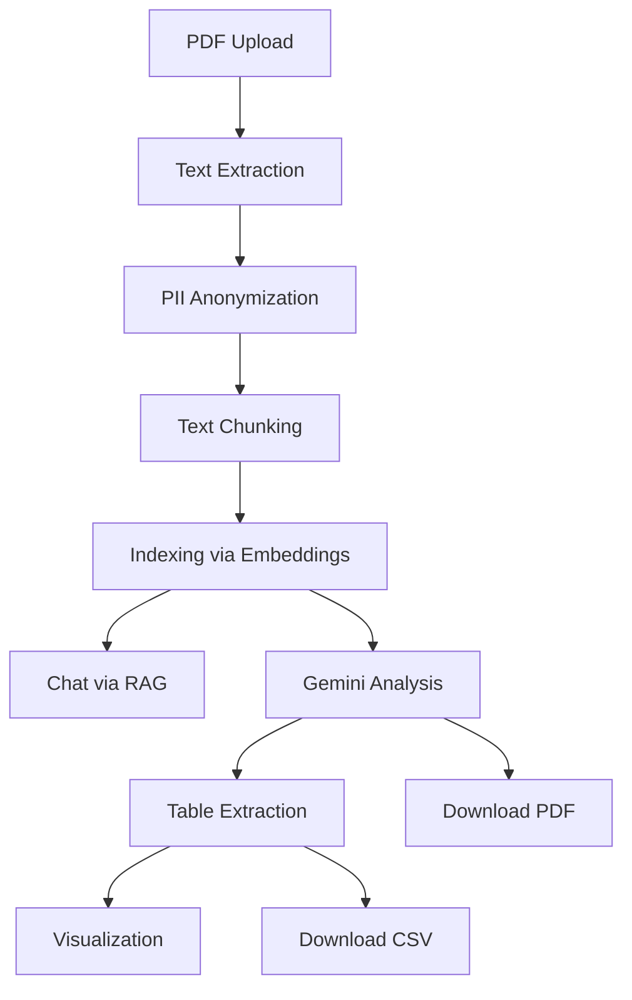

Based on your code (`app.py`, `chat_feature.py`, etc.) and the structure of the project, here's a professional-level `README.md` for your Flask-based medical PDF analysis and chat assistant application:

---

# 🧠 MediScan AI – Intelligent Medical Report Analyzer

MediScan AI is a secure, AI-powered web application that extracts, analyzes, and visualizes content from medical PDFs. Built with Flask and Google’s Gemini API, it supports personalized document exploration and chat with privacy-first anonymization.

---

## 🚀 Features

* 📄 **PDF Upload & Text Extraction**
  Extracts structured and raw text using a hybrid of PyMuPDF, PDFPlumber, and Tesseract OCR.

* 🧠 **Medical Report Analysis via Gemini**
  Performs comprehensive report analysis using Google’s Gemini 1.5 API.

* 💬 **RAG-Enabled Chat System**
  Enables question-answering over uploaded reports using Retrieval-Augmented Generation (RAG) and embedding search.

* 🔍 **Anonymization of PII**
  Automatically redacts names, addresses, dates, and other sensitive information using regex and section-aware logic.

* 📊 **Visualizations**
  Generates meaningful plots from biomarker tables using Matplotlib/Seaborn and displays them in-browser.

* 📥 **PDF/CSV Report Downloads**
  Users can download detailed analysis reports and extracted tables.

---

## 🛠️ Tech Stack

| Component         | Description                            |
| ----------------- | -------------------------------------- |
| **Backend**       | Flask (Python)                         |
| **AI Models**     | Gemini 1.5 Flash, SentenceTransformers |
| **Frontend**      | HTML + Bootstrap (Jinja2 Templates)    |
| **OCR & Text**    | PyMuPDF, PDFPlumber, Tesseract OCR     |
| **Vector DB**     | In-memory FAISS-like structure         |
| **Visualization** | Matplotlib / base64 delivery via API   |

---

## 🧩 Architecture Overview



---

## ⚙️ Setup Instructions

### 1. Clone the Repository

```bash
git clone https://github.com/yourusername/mediscan-ai.git
cd mediscan-ai
```

### 2. Install Requirements

```bash
pip install -r requirements.txt
```

### 3. Set Environment Variables

Create a `.env` file in the root directory:

```env
GEMINI_API_KEY=your_gemini_api_key
FLASK_SECRET_KEY=replace-this-with-a-random-string
```

### 4. Run the Application

```bash
python app.py
```

Visit: `http://localhost:5000`

---

## 🧪 Key Modules

| File                 | Purpose                           |
| -------------------- | --------------------------------- |
| `app.py`             | Flask routes and session logic    |
| `extract_text.py`    | Handles text/OCR/table extraction |
| `chat_feature.py`    | Chatbot logic with context memory |
| `gemini_api.py`      | Wrapper around Gemini API calls   |
| `confidentiality.py` | Anonymizes PII in text            |
| `vector_db.py`       | Embedding search for RAG          |
| `generate_report.py` | Exports analysis to PDF           |
| `save_table.py`      | Parses and saves biomarker table  |
| `visualizations.py`  | Generates charts from CSV         |

---

## ✅ To-Do / Roadmap

* [ ] Add support for DOCX uploads
* [ ] Integrate user login system
* [ ] Track analytics on report types and queries
* [ ] Deploy to cloud with HTTPS support

---

## ⚠️ Disclaimer

This application is intended for **educational and informational** use only. It does **not** provide medical advice or replace professional healthcare consultation.

---

## 📄 License

MIT License. See `LICENSE` for details.

